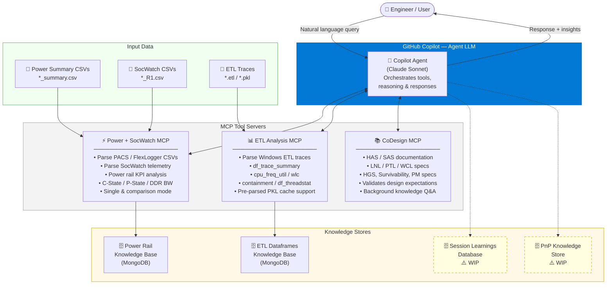

# PnP Debug Agent — Architecture Flowchart

```mermaid
flowchart TD
    User(["👤 Engineer / User"])

    subgraph Copilot ["GitHub Copilot — Agent LLM"]
        direction TB
        Orchestrator["🤖 Copilot Agent\n(Claude Sonnet)\nOrchestrates tools,\nreasoning & responses"]
    end

    subgraph MCPs ["MCP Tool Servers"]
        direction TB
        PowerMCP["⚡ Power + SocWatch MCP\n─────────────────────\n• Parse PACS / FlexLogger CSVs\n• Parse SocWatch telemetry\n• Power rail KPI analysis\n• C-State / P-State / DDR BW\n• Single & comparison mode"]

        ETLMCP["📊 ETL Analysis MCP\n─────────────────────\n• Parse Windows ETL traces\n• df_trace_summary\n• cpu_freq_util / wlc\n• containment / df_threadstat\n• Pre-parsed PKL cache support"]

        CoDesignMCP["📚 CoDesign MCP\n─────────────────────\n• HAS / SAS documentation\n• LNL / PTL / WCL specs\n• HGS, Survivability, PM specs\n• Validates design expectations\n• Background knowledge Q&A"]
    end

    subgraph Knowledge ["Knowledge Stores"]
        direction TB
        PowerKB["🗄️ Power Rail\nKnowledge Base\n(MongoDB)"]
        ETLKB["🗄️ ETL Dataframes\nKnowledge Base\n(MongoDB)"]
        SessionDB["🗄️ Session Learnings\nDatabase\n⚠️ WIP"]
        PnPKB["🗄️ PnP Knowledge\nStore\n⚠️ WIP"]
    end

    subgraph DataSources ["Input Data"]
        direction TB
        PowerCSV["📁 Power Summary CSVs\n*_summary.csv"]
        SocWatchCSV["📁 SocWatch CSVs\n*_R1.csv"]
        ETLFiles["📁 ETL Traces\n*.etl / *.pkl"]
    end

    User -- "Natural language query" --> Orchestrator
    Orchestrator -- "Response + insights" --> User

    Orchestrator <--> PowerMCP
    Orchestrator <--> ETLMCP
    Orchestrator <--> CoDesignMCP

    PowerMCP --> PowerKB
    ETLMCP --> ETLKB
    Orchestrator -.-> SessionDB
    Orchestrator -.-> PnPKB

    PowerCSV --> PowerMCP
    SocWatchCSV --> PowerMCP
    ETLFiles --> ETLMCP

    style Copilot fill:#0078d4,color:#fff,stroke:#005a9e
    style MCPs fill:#f3f3f3,stroke:#999
    style Knowledge fill:#fff8e7,stroke:#cca300
    style DataSources fill:#f0fff0,stroke:#4caf50
    style SessionDB stroke:#cca300,stroke-dasharray:5 5,fill:#fffde0
    style PnPKB stroke:#cca300,stroke-dasharray:5 5,fill:#fffde0
```
